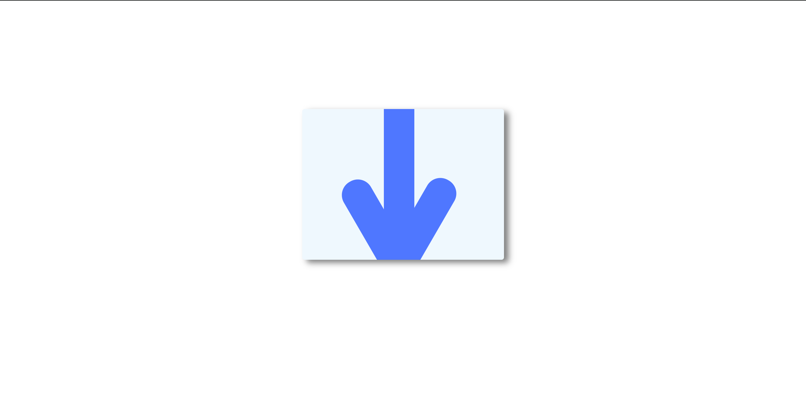

<h1>Blue Down Arrow</h1>

This challenge involves creating a blue down arrow using only HTML and CSS. The arrow design includes an arrow shaft and two wings, which are styled and positioned to create the desired shape. This challenge was inspired by a target on CSS Battle.

<h2>Table of Contents</h2>
<ul>
    <li><a href="#introduction">Introduction</a></li>
    <li><a href="#purpose">Purpose</a></li>
    <li><a href="#prerequisites">Prerequisites</a></li>
    <li><a href="#file-structure">File Structure</a></li>
    <li><a href="#tools">Tools</a></li>
    <li><a href="#preview">Preview</a></li>
    <li><a href="#credits">Credits</a></li>
</ul>

<h2 id="introduction">Introduction</h2>

The 'Blue Down Arrow' challenge is a CSS-only challenge that demonstrates how to create a simple yet effective arrow shape using CSS properties. This challenge is perfect for practicing positioning, transformations, and working with pseudo-elements.

<h2 id="purpose">Purpose</h2>

The purpose of this challenge is to enhance your CSS skills by creating a visual element using minimal HTML and leveraging CSS for the entire design. It helps in understanding how to manipulate shapes and position elements precisely.

<h2 id="prerequisites">Prerequisites</h2>
<ul>
    <li>Basic knowledge of HTML and CSS</li>
    <li>Familiarity with CSS positioning and transformations</li>
</ul>

<h2 id="file-structure">File Structure</h2>

The project consists of the following files:

<pre>
Blue-Down-Arrow/
│
├── index.html
└── styles.css
</pre>

<h2 id="tools">Tools</h2>
<ul>
    <li>A code editor (e.g., VSCode)</li>
    <li>A web browser for viewing the demo</li>
</ul>

<h2 id="preview">Preview</h2>

You can view the live demo of the challenge <a href="https://codepen.io/Yashi-the-lessful/pen/bGyXNJY">here</a>.

<h2 id="credits">Credits</h2>

This challenge is inspired by a target of the day on <a href="https://cssbattle.dev/play/RWjRJZqaY8y1481oqgNg">CSS Battle</a>.

